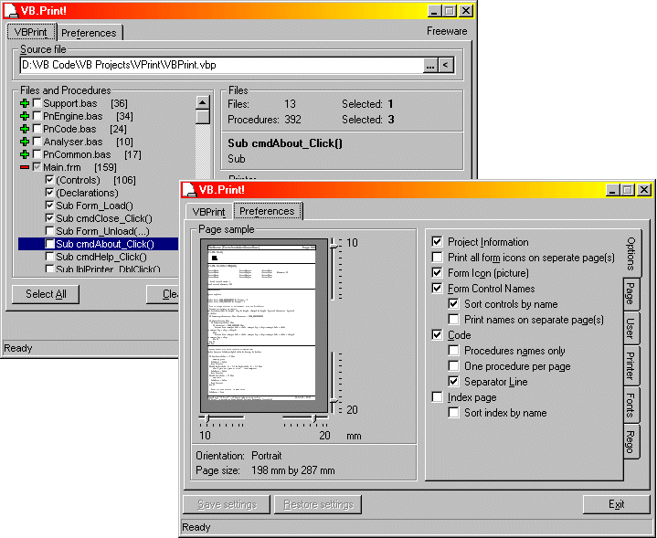



## VB\.Print \- Source code printing utility

### Description

Need the print source code (at least under YOUR control)? Used to be a shareware product, but now a freeware product. Enclosed packed executable for immediate usage. Has sounds for fun. Output can be standard windows printer object, an old text printer (direct to port) or rich-text file. Complete with preview, project information, print icons from each form, form control names list, index. Oh, see for yourself for the rest. Have fun. (Updated using VB6)
 
### More Info
 
VB Projects, Files, etc.

Place the wave files together with the executable.

Text on paper.

             |
---                |---
**Submitted On**   |2000-07-06 10:38:24
**By**             |[Tony](https://github.com/Planet-Source-Code/PSCIndex/blob/master/ByAuthor/tony.md)
**Level**          |Advanced
**User Rating**    |4.7 (98 globes from 21 users)
**Compatibility**  |VB 4\.0 \(32\-bit\), VB 5\.0, VB 6\.0
**Category**       |[Complete Applications](https://github.com/Planet-Source-Code/PSCIndex/blob/master/ByCategory/complete-applications__1-27.md)
**World**          |[Visual Basic](https://github.com/Planet-Source-Code/PSCIndex/blob/master/ByWorld/visual-basic.md)
**Archive File**   |[CODE\_UPLOAD7477762000\.zip](https://github.com/Planet-Source-Code/tony-vb-print-source-code-printing-utility__1-9493/archive/master.zip)

